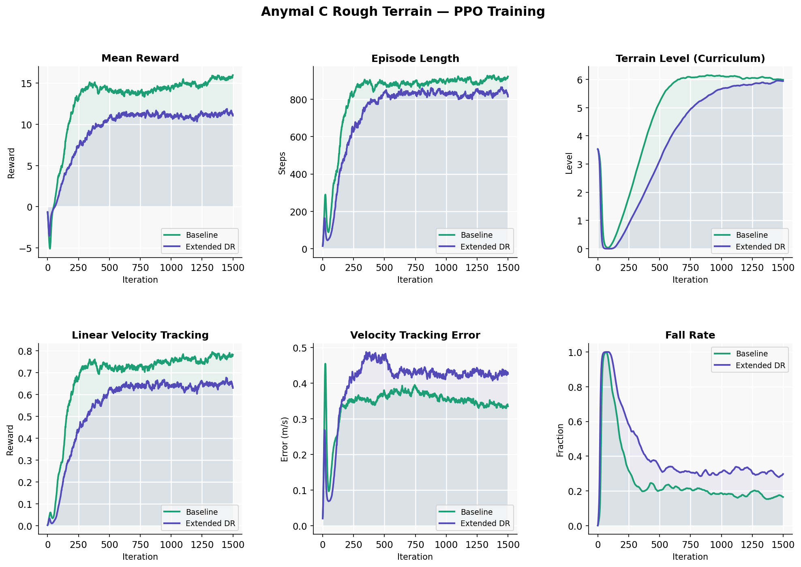
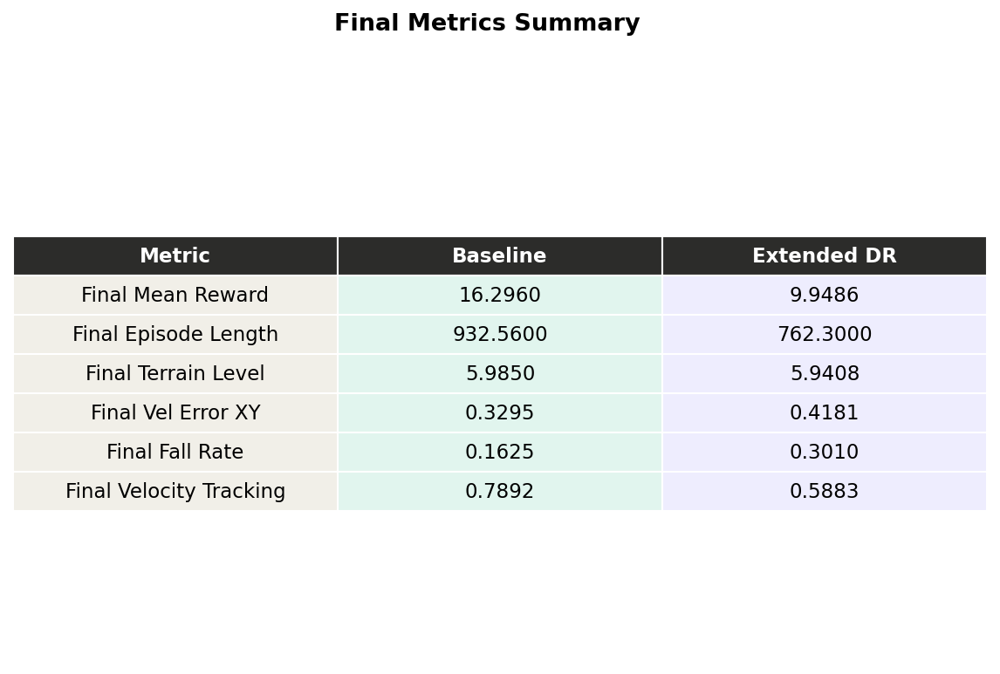
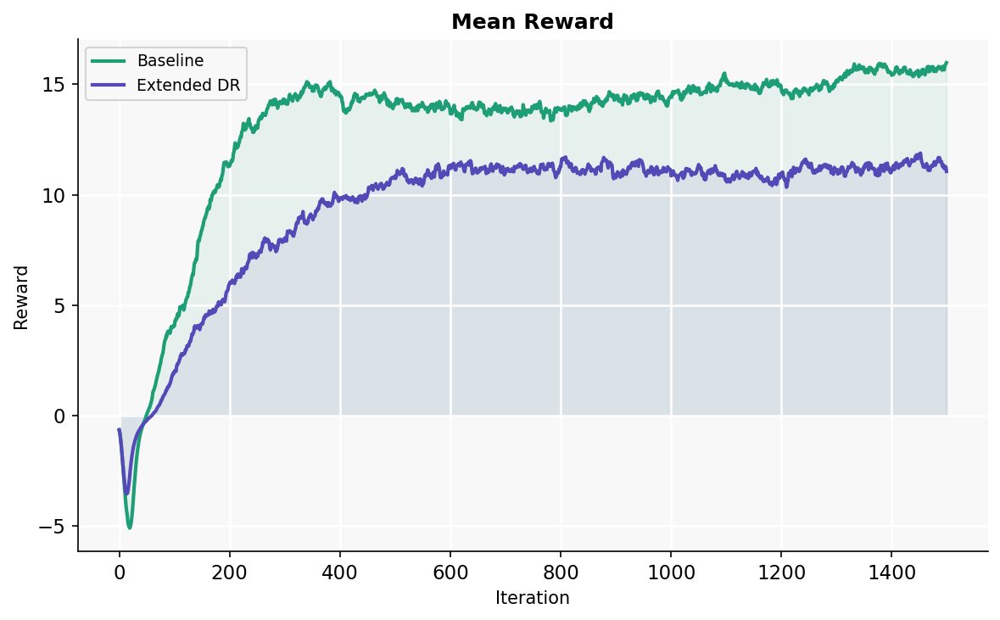
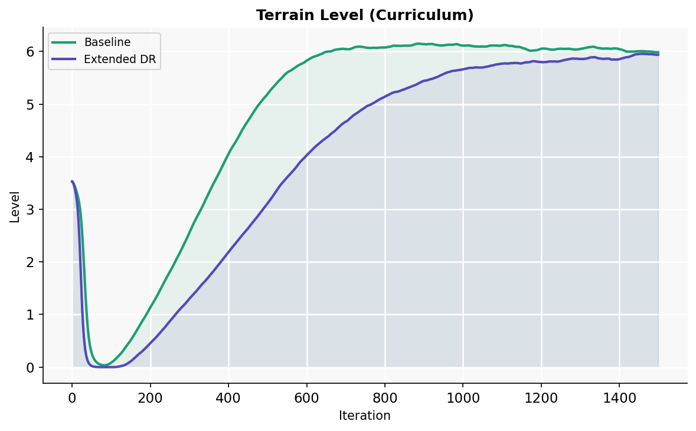
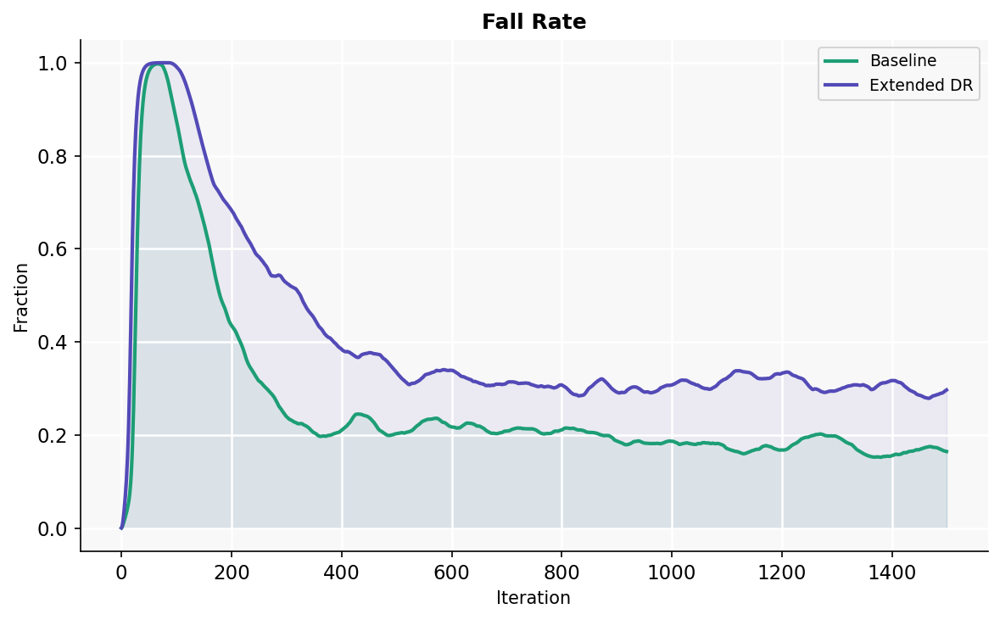
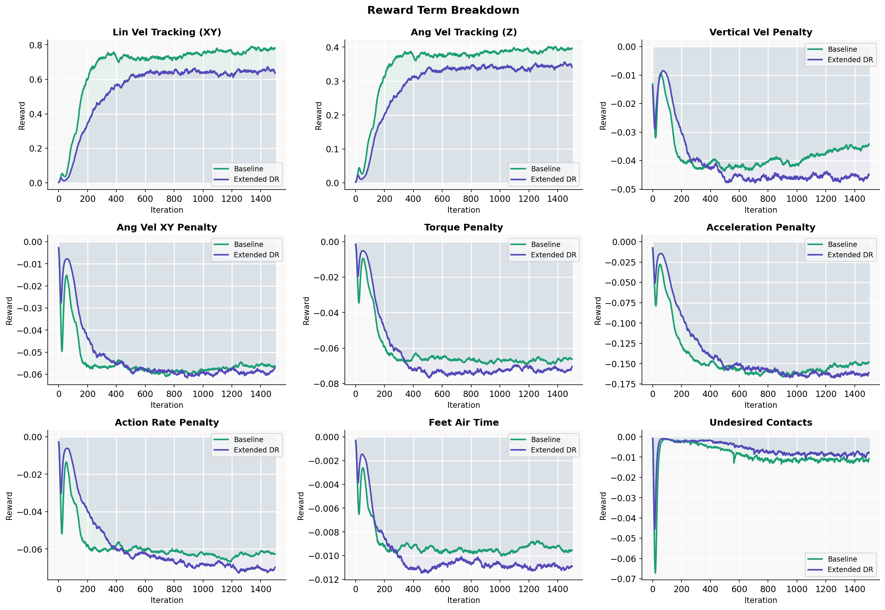

# Quadruped Locomotion with Domain Randomization in Isaac Lab

Training PPO locomotion policies for the [Anymal C](https://www.anybotics.com/anymal-autonomous-legged-robot/) quadruped in [Isaac Lab](https://isaac-sim.github.io/IsaacLab/) and evaluating the effect of extended domain randomization on sim-to-real transfer robustness.

Two policies were trained from scratch on rough terrain for 1500 iterations (~147M steps each):

- **Baseline** — default Isaac Lab randomization (fixed friction, ±5 kg mass perturbation, ±0.5 m/s pushes)
- **Extended DR** — wider randomization ranges designed to cover real-world deployment variability

---

## Results



### Key Metrics Comparison



| Metric | Baseline | Extended DR |
|--------|----------|-------------|
| Final mean reward | **16.30** | 9.95 |
| Final episode length | **932 steps** | 762 steps |
| Terrain level reached | **5.98 / 8** | 5.94 / 8 |
| Velocity tracking error | 0.33 m/s | 0.42 m/s |
| Fall rate | **16%** | 30% |
| Time-out rate (survived) | **84%** | 70% |

### Training Curves

**Mean Reward**



**Terrain Level (Curriculum)**



**Fall Rate**



**Reward Term Breakdown**



---

## Domain Randomization Design

The extended DR config (`configs/anymal_c_rough_dr_env_cfg.py`) overrides the following parameters relative to the baseline:

| Parameter | Baseline | Extended DR | Motivation |
|-----------|----------|-------------|------------|
| Static friction | fixed 0.8 | **0.2 – 1.5** | Covers wet floor to dry concrete |
| Dynamic friction | fixed 0.6 | **0.1 – 1.2** | Surface variability |
| Base mass perturbation | ±5 kg | **±10 kg** | Payload and model error |
| CoM offset (x/y) | ±0.05 m | **±0.15 m** | Payload mounting variation |
| CoM offset (z) | ±0.01 m | **±0.05 m** | Vertical CoM shift |
| Joint friction/armature | none | **randomized** | Actuator wear and mismatch |
| Push velocity | ±0.5 m/s | **±1.5 m/s** | Stronger disturbances |
| Push interval | 10–15 s | **5–10 s** | More frequent disturbances |

---

## Analysis

The extended DR policy reaches a comparable terrain curriculum level (5.94 vs 5.98) despite training under significantly harder conditions, confirming that the policy learned robust locomotion rather than overfitting to nominal dynamics.

The performance gap — lower reward, shorter episodes, higher fall rate — reflects the cost of robustness: the policy must handle a much wider distribution of physics parameters at every episode reset, making convergence harder and peak performance lower. This tradeoff is well-documented in sim-to-real locomotion literature and is the expected outcome of aggressive domain randomization.

For real-world deployment, the extended DR policy is the preferred choice: friction, mass distribution, and actuator characteristics of a physical robot are never exactly known, and a policy trained only on nominal parameters is likely to fail under even small real-world deviations.

---

## Setup

This project requires [Isaac Lab](https://isaac-sim.github.io/IsaacLab/) with Isaac Sim 5.0.

**Register the extended DR task:**

Copy `configs/anymal_c_rough_dr_env_cfg.py` to:
```
source/isaaclab_tasks/isaaclab_tasks/manager_based/locomotion/velocity/config/anymal_c/
```

Add to `__init__.py` in that directory:
```python
gym.register(
    id="Isaac-Velocity-Rough-Anymal-C-ExtendedDR-v0",
    entry_point="isaaclab.envs:ManagerBasedRLEnv",
    disable_env_checker=True,
    kwargs={
        "env_cfg_entry_point": f"{__name__}.anymal_c_rough_dr_env_cfg:AnymalCRoughEnvCfg_ExtendedDR",
        "rsl_rl_cfg_entry_point": f"{agents.__name__}.rsl_rl_ppo_cfg:AnymalCRoughPPORunnerCfg",
    },
)
```

**Train baseline:**
```bash
./isaaclab.sh -p scripts/reinforcement_learning/rsl_rl/train.py \
    --task=Isaac-Velocity-Rough-Anymal-C-v0 \
    --num_envs=4096 --headless
```

**Train extended DR:**
```bash
./isaaclab.sh -p scripts/reinforcement_learning/rsl_rl/train.py \
    --task=Isaac-Velocity-Rough-Anymal-C-ExtendedDR-v0 \
    --num_envs=4096 --headless
```

**Generate comparison plots:**
```bash
python3 plot_training.py \
    --baseline logs/rsl_rl/anymal_c_rough/<baseline_run> \
    --dr logs/rsl_rl/anymal_c_rough/<dr_run> \
    --out plots/comparison
```

---

## Environment

- Isaac Lab 0.45.9 / Isaac Sim 5.0
- PyTorch 2.7.0 + CUDA 12.8
- RSL-RL 2.3.3 (PPO)
- GPU: NVIDIA RTX 5070 Ti (12 GB)
- Training time: ~1.5 hours per run at 4096 parallel environments
